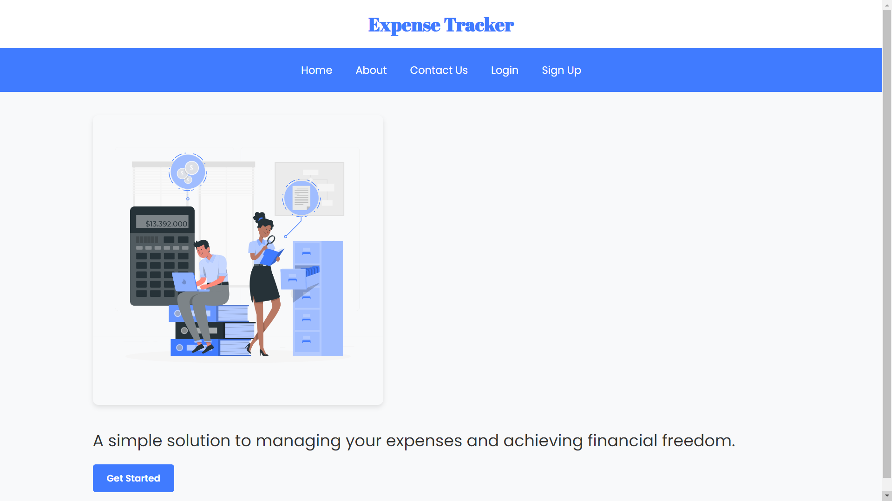
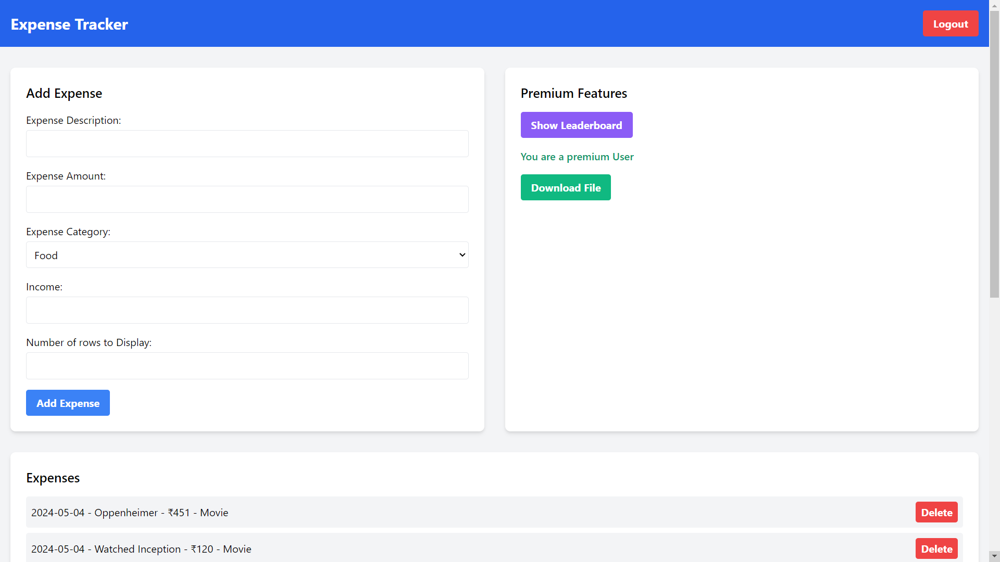

# Expense Tracker

An efficient and secure web application for managing personal finances.


## Features

- User account management with secure authentication
- Expense tracking and categorization
- Password recovery with secure reset emails
- Expense report generation and download (via Amazon S3)
- Integrated payment processing with Razorpay


## Tech Stack
- Backend: Node.js with Express.js
- Database: NoSQL
- Cloud Services: Amazon S3 for file storage
- Payment Integration: Razorpay
- Email Service: Brevo (formerly SendInBlue)


## Screenshots

- Home 
  
- Signup
  
- Login
  
- Expenses
  


## Run Locally

Clone the project

```bash
  git clone https://github.com/chaithanyakumar47/expensetracker.git
```

Go to the project directory

```bash
  cd expensetracker
```

Install dependencies

```bash
  npm install
```

Set up environment variables:
- Create a ```.env``` file in the root directory

```
DB_HOST=your_database_host
DB_USER=your_database_user
DB_PASSWORD=your_database_password
DB_NAME=your_database_name
AWS_ACCESS_KEY=your_aws_access_key
AWS_SECRET_KEY=your_aws_secret_key
RAZORPAY_KEY_ID=your_razorpay_key_id
RAZORPAY_KEY_SECRET=your_razorpay_key_secret
BREVO_API_KEY=your_brevo_api_key
```

Start the server

```bash
  npm start
```

